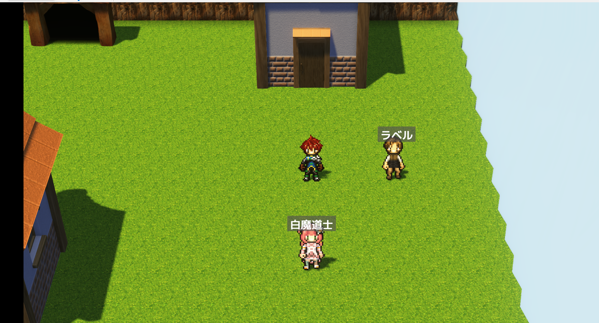
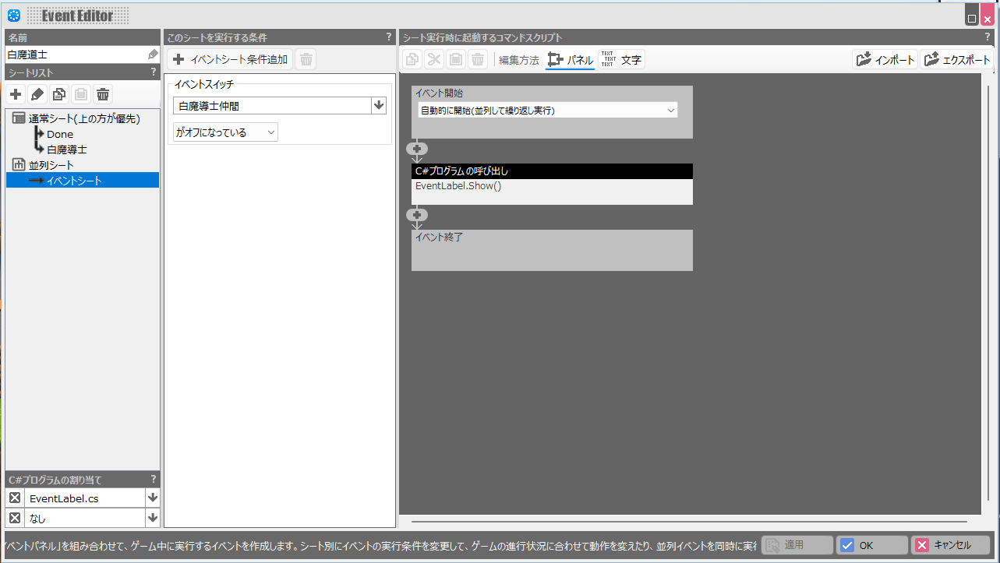
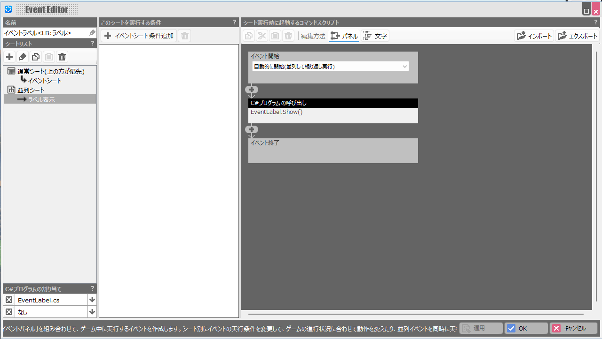

# EventLabel

**RPG Developer Bakin プラグイン**: キャストの頭上にテキストラベルを浮遊表示します。

---

## 概要

キャストイベント（NPC・宝箱・オブジェクトなど）の頭上に、テキストラベルを表示するプラグインです。

RPG ツクール系で定番の「頭上ラベル」機能を **RPG Developer Bakin ネイティブ** の設計で実装しました。ツクールから Bakin に移行してきた方も、Bakin から入った方も、直感的に使えるよう設計しています。

### 特徴

- **キャスト名を書くだけで頭上表示**（追加設定不要）
- **`<LB:表示名>` 記法** でキャスト名と表示名を分離可能
- **白文字 + 半透明ダークグレー背景** で視認性を確保
- **並列シートの条件** で表示 ON/OFF を自然に制御（追加の状態管理不要）
- **マップ切替・セーブロードに透過**（状態を持たない Immediate Mode 設計）

---

## インストール

1. [EventLabel.cs](./EventLabel.cs) をダウンロード
2. あなたの Bakin プロジェクトの `script/` フォルダに配置
   - パス例: `C:\Users\<ユーザー名>\Documents\SmileBoom\Bakin\<プロジェクト名>\script\EventLabel.cs`
3. Bakin エディタを再起動 → 自動でスクリプトが認識されます

---

## 使い方

### 基本: キャスト名を頭上に表示する

1. ラベルを表示したいキャストのイベントを開く
2. **並列シートを追加** し、以下の設定にする:
   - **イベント開始**: 「自動的に開始（並列して繰り返し実行）」を選択
3. イベントコマンドで **C# プログラムの呼び出し** を追加:
   - **クラス**: `EventLabel`
   - **メソッド**: `Show()`
4. プレイテスト → キャスト名が頭上に表示されます

### 表示名をキャスト名と分けたい

キャスト名に `<LB:xxx>` 記法を含めると、`xxx` の部分だけが頭上に表示されます。管理用の識別名と表示名を分けたいときに便利です。

| キャスト名 | 頭上の表示 |
|---|---|
| `勇者` | 勇者 |
| `商人01<LB:武器屋の親父>` | 武器屋の親父 |
| `宝箱<LB:>` | （空・非表示） |

### 表示を条件付きにする

**話しかけたらラベルが消える例**:

- 並列シート（条件: セルフスイッチ A が OFF）: `EventLabel.Show()` を呼ぶ
- 通常シート（話しかけ時）: セルフスイッチ A を ON にする

セルフスイッチ A が ON になると並列シートが停止し、次のフレームでラベルが自動的に消えます。マップを移動して戻ってきても、セルフスイッチの状態は保存されているので、意図した通りに復元されます。

---

## API リファレンス

### `Show()`

- **引数**: なし
- **戻り値**: なし

**動作**:
- このフレームでラベルを表示するリクエストを立てます
- 並列シート内で呼び続けている間だけ表示されます
- 呼ばれなくなると **次のフレームで自動的に非表示** になります（`Hide()` 相当のメソッドは不要）

**表示文字列の決定ロジック**:

1. キャスト名に `<LB:xxx>` が含まれていれば `xxx` を表示
2. 含まれていなければキャスト名全体を表示

### 設計方針: Immediate Mode

このプラグインは C# 側で **状態を保持しません**。並列シートの実行がそのまま表示条件になります。

- ✅ マップ切替・セーブロードで状態リセットに悩まされない
- ✅ 表示 ON/OFF の制御を Bakin のイベントシステム（スイッチ・変数）に一元化できる
- ✅ 追加の初期化・破棄処理が不要

---

## ロードマップ

現在のバージョンは **v0.1.0（初回リリース）** です。ユーザーの声を見ながら次を検討します:

- 表示位置オフセット指定
- スタイル指定（色・サイズ・フォント）
- テール（吹き出しの尻尾）表示
- 制御文字対応（変数値のリアルタイム反映）

「こんな機能が欲しい」というリクエストは [Issues](https://github.com/rain-bakin/BakinEventLabel/issues) にお願いします。

---

## ライセンス

[MIT License](./LICENSE)

商用/非商用問わず報告なしで自由にご利用頂けます。

---

## 参考
RPGツクールのEventLabel.jsプラグインに着想を得て作成しました。

[RPGツクール版のプラグイン](https://github.com/triacontane/RPGMakerMV/blob/mz_master/EventLabel.js)

---

## 作者

- **X**: [@rain_bakin](https://twitter.com/rain_bakin)
- **GitHub**: [rain-bakin](https://github.com/rain-bakin)

Bakin プラグインを継続的に作っていく予定です。フォローしてくれると嬉しいです。
